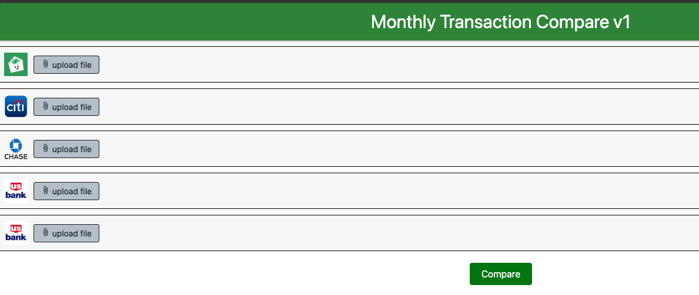

# Table of Contents

- [Overview](#overview)
- [Getting Started](#getting-started)
- [Endpoints](#endpoints)
- [Prerequisites](#prerequisites)
- [Installing Dependencies](#installing-dependencies)
- [Running the Server](#running-the-server)
- [Built With](#built-with)
- [Authors](#authors)
- [License](#license)

## Overview

This project implements an Express server to compare CSV bank statements uploaded by a user. The server processes the uploaded files, compares them, and stores the results in memory.

This is a very specific use case which uses the app [Good Budget](https://goodbudget.com/) as the source of monthly transactions, and then the bank statements are compared against the transactions in GB to see what was missed.

The idea behind this is GB is used as a "digital envelope" system and each transaction made in a month should be recorded shortly after it takes place. This is a manual entry by a user, either done via the GB Web or Phone App. Of course life happens, so some receipts get missed. That's why we need to verify against our credit card & checking account.



## Getting Started

To get started, follow the instructions below to set up the project and run the server.

## Endpoints

1. `GET /` - serves the frontend HTML file for users to interact with the server.
2. `POST /upload` - handles the file upload and comparison process.
3. `GET /data` - returns the stored comparison results.

## Prerequisites

Before running the server, make sure you have the following installed:

- Node.js
- npm (Node Package Manager)

## Installing Dependencies

After cloning the repository, navigate to the project directory and install the required dependencies:

```bash
npm install
```

## Building after changes

```bash
npm run build
```

## Running the Server

To start the Express server, use the following command:

```bash
npm start
```

The server will start running on <http://localhost:3000>.

## How it Works

1. Users can interact with the frontend to upload up to five CSV files.
2. The server receives the uploaded files, processes them, and compares their contents using the `compareCSVs` function from the `compare.ts` file.
3. The comparison results are stored in memory as an array of objects, where each object contains the file names and the differences.
4. Users can access the `/data` endpoint to retrieve the stored comparison results.

## Built With

- Node.js
- Express.js
- Multer (for file uploads)
- CORS (Cross-Origin Resource Sharing)

## Authors

- [Mark Bixler](https://github.com/mark-bixler) - Owner

## License

This project is licensed under the [MIT License](LICENSE).

---

Feel free to modify this README to add any additional information, instructions, or clarifications specific to your project. The README serves as a helpful guide for users who want to understand and use your CSV Comparison Express Server.
